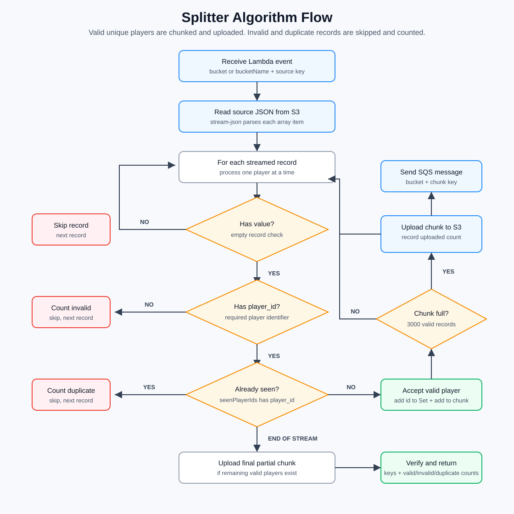

# Data Pipeline Project
## Status

⚠️  This project is under active development and not intended for production use.

## Project Overview
A serverless data processing pipeline that splits large JSON files into smaller chunks using AWS Lambda, Step Functions, SNS, and SQS.

This project processes large JSON files (containing player records) by splitting them into smaller chunks (max 3000 records each) and stores them in S3. It uses AWS Lambda for processing, Step Functions for orchestration, SNS for notifications, and SQS for messaging.

## Architecture

```
Large JSON File (S3)
        ↓
Splitter Lambda (splits into chunks)
        ↓
S3 (stores chunk files)
        ↓
SQS (sends chunk messages)
        ↓
Sender Lambda (processes each chunk)
        ↓
SNS (sends completion notification)
        ↓
SNS.js Listener (HTTP endpoint)
```



## Project Structure

```
.
├── build/                    # Lambda function zip files
│   ├── splitter_function.zip
│   └── sender_function.zip
├── data/                     # Test data files
│   └── mock-rud.json         # Sample JSON file (10,000 records)
├── dynamoDB/                 # DynamoDB setup (optional)
├── listener/                 # SNS HTTP endpoint
│   └── SNS.js               # Express server to receive SNS notifications
├── sender/                   # Sender Lambda function
│   ├── index.js
│   └── package.json
├── splitter/                 # Splitter Lambda function
│   ├── index.js
│   └── package.json
├── terraform/                # Infrastructure as Code
│   ├── main.tf              # Main Terraform configuration
│   ├── variables.tf         # Variable definitions
│   └── provider.tf          # Provider configuration
├── docker-compose.yaml       # LocalStack setup
└── README.md       # Startup process
```

## Prerequisites

- Docker
- AWS CLI
- Node.js 18+

## Quick Start

### 1. Start LocalStack

```bash
docker-compose up -d
```

Wait 30 seconds for LocalStack to initialize.

### 2. Create S3 Bucket

```bash
aws --endpoint-url=http://localhost:4566 s3 mb s3://report-store
```

### 3. Upload Test Data

```bash
aws --endpoint-url=http://localhost:4566 s3 cp ./data/mock-rud.json s3://report-store/rud/monthly/2024/11/202411-123456789-RUD.json
```

### 4. Build Lambda Functions

```bash
# Build splitter
cd splitter && npm install && cd ..
zip -r build/splitter_function.zip splitter/index.js splitter/package.json splitter/node_modules/ -x "*/node_modules/*"

# Build sender
cd sender && npm install && cd ..
zip -r build/sender_function.zip sender/index.js sender/package.json sender/node_modules/ -x "*/node_modules/*"
```

Or use the packager container:

```bash
docker-compose build packager
```

### 5. Apply Terraform

```bash
docker-compose run terraform init
docker-compose run terraform apply -auto-approve
```

### 6. Start SNS Listener

```bash
cd listener
npm install
node SNS.js
```

### 7. Invoke Splitter Lambda

```bash
aws --endpoint-url=http://localhost:4566 \
    --region eu-west-1 \
    lambda invoke \
    --function-name splitter_function \
    --payload '{"key": "rud/monthly/2024/11/202411-123456789-RUD.json"}' \
    --cli-binary-format raw-in-base64-out \
    output.json
```

### 8. Verify Results

```bash
aws --endpoint-url=http://localhost:4566 --region eu-west-1 s3 ls s3://report-store/ --recursive
```

## Environment Variables

### Splitter Lambda

| Variable | Description | Default |
|----------|-------------|---------|
| BUCKET_NAME | S3 bucket name | report-store |
| LOCALSTACK_ENDPOINT | LocalStack endpoint | http://host.docker.internal:4566 |
| SNS_TOPIC_ARN | SNS topic ARN | arn:aws:sns:eu-west-1:000000000000:splitter_status |
| SQS_URL | SQS queue URL | http://host.docker.internal:4566/000000000000/my-sqs-queue |

### Sender Lambda

| Variable | Description | Default |
|----------|-------------|---------|
| BUCKET_NAME | S3 bucket name | report-store |
| LOCALSTACK_ENDPOINT | LocalStack endpoint | http://host.docker.internal:4566 |

## Testing

### Run Unit Tests

```bash
cd splitter
npm test
```

## Cleanup

```bash
# Stop LocalStack
docker-compose down

# Delete S3 bucket
aws --endpoint-url=http://localhost:4566 s3 rb s3://report-store --force
```

## Troubleshooting

### Lambda Timeout

If you get timeout errors, increase the Lambda timeout:

```bash
aws --endpoint-url=http://localhost:4566 --region eu-west-1 lambda update-function-configuration \
    --function-name splitter \
    --timeout 900
```

### Region Mismatch

Always specify the region when using AWS CLI with LocalStack:

```bash
aws --endpoint-url=http://localhost:4566 --region eu-west-1 ...
```

### SNS Subscription Not Confirmed

If SNS notifications aren't working, delete and recreate the subscription:

```bash
aws --endpoint-url=http://localhost:4566 --region eu-west-1 sns unsubscribe \
    --subscription-arn "PendingConfirmation"
```

Then make sure SNS.js is running before applying Terraform.

## License

MIT
